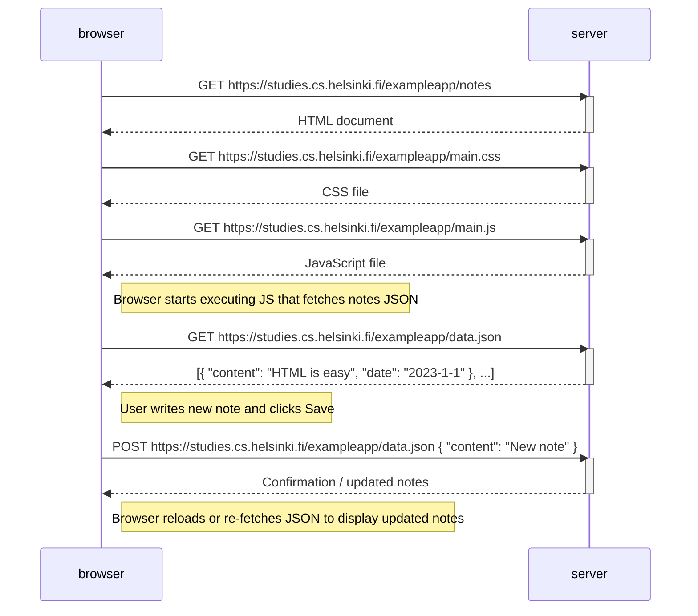
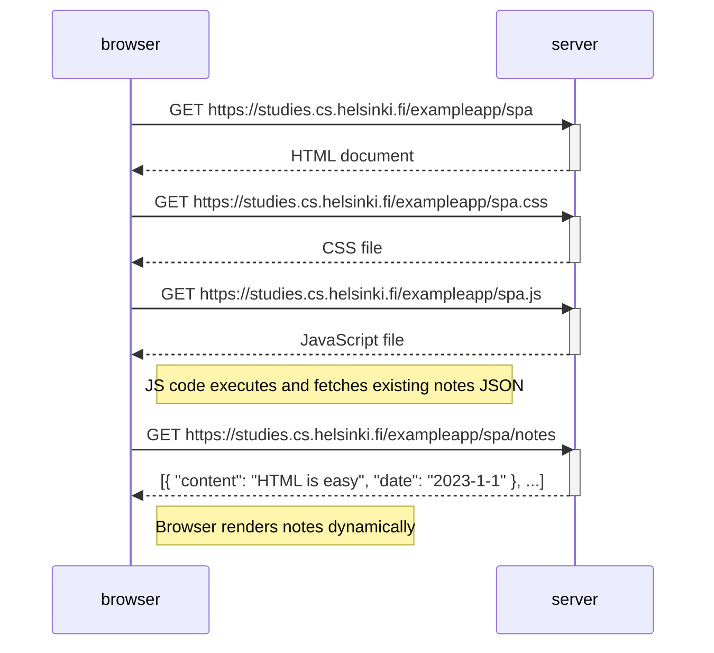
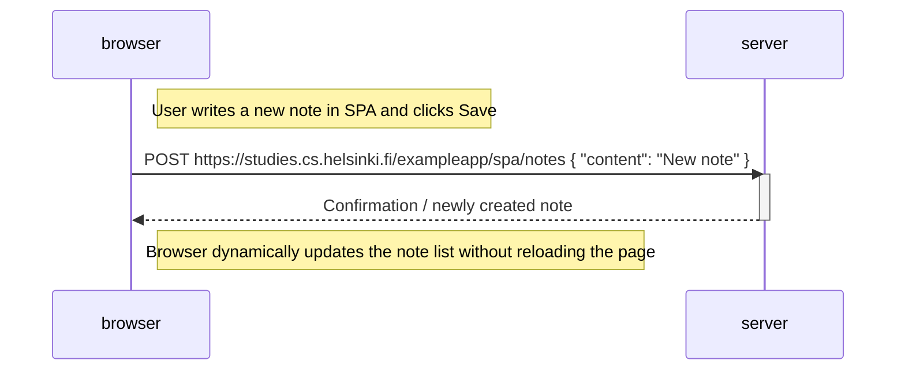

```markdown
# 0.4 Nueva nota en la versión clásica

```mermaid
sequenceDiagram
    participant browser
    participant server

    browser->>server: GET https://studies.cs.helsinki.fi/exampleapp/notes
    activate server
    server-->>browser: HTML document
    deactivate server

    browser->>server: GET https://studies.cs.helsinki.fi/exampleapp/main.css
    activate server
    server-->>browser: CSS file
    deactivate server

    browser->>server: GET https://studies.cs.helsinki.fi/exampleapp/main.js
    activate server
    server-->>browser: JavaScript file
    deactivate server

    Note right of browser: Browser starts executing JS that fetches notes JSON

    browser->>server: GET https://studies.cs.helsinki.fi/exampleapp/data.json
    activate server
    server-->>browser: [{ "content": "HTML is easy", "date": "2023-1-1" }, ...]
    deactivate server

    Note right of browser: User writes new note and clicks Save

    browser->>server: POST https://studies.cs.helsinki.fi/exampleapp/data.json { "content": "New note" }
    activate server
    server-->>browser: Confirmation / updated notes
    deactivate server

    Note right of browser: Browser reloads or re-fetches JSON to display updated notes

```
# 0.5 Aplicación de una sola página (SPA) - al cargar

```mermaid
sequenceDiagram
    participant browser
    participant server

    browser->>server: GET https://studies.cs.helsinki.fi/exampleapp/spa
    activate server
    server-->>browser: HTML document
    deactivate server

    browser->>server: GET https://studies.cs.helsinki.fi/exampleapp/spa.css
    activate server
    server-->>browser: CSS file
    deactivate server

    browser->>server: GET https://studies.cs.helsinki.fi/exampleapp/spa.js
    activate server
    server-->>browser: JavaScript file
    deactivate server

    Note right of browser: JS code executes and fetches existing notes JSON

    browser->>server: GET https://studies.cs.helsinki.fi/exampleapp/spa/notes
    activate server
    server-->>browser: [{ "content": "HTML is easy", "date": "2023-1-1" }, ...]
    deactivate server

    Note right of browser: Browser renders notes dynamically
```

---
# 0.6 Nueva nota en SPA

```mermaid
sequenceDiagram
    participant browser
    participant server

    Note right of browser: User writes a new note in SPA and clicks Save

    browser->>server: POST https://studies.cs.helsinki.fi/exampleapp/spa/notes { "content": "New note" }
    activate server
    server-->>browser: Confirmation / newly created note
    deactivate server

    Note right of browser: Browser dynamically updates the note list without reloading the page
```

